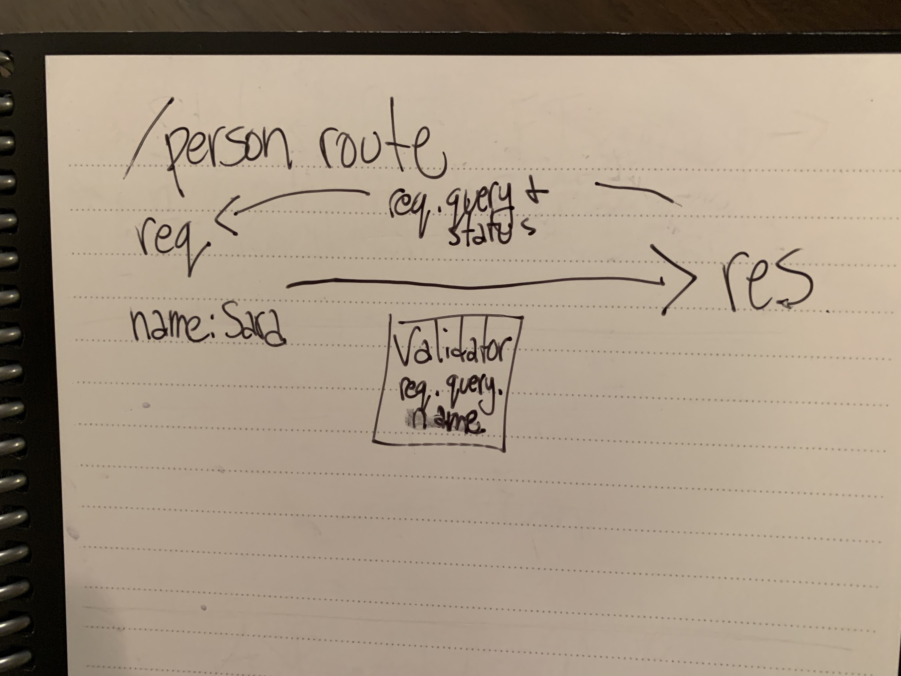

# LAB 2

## Project: Basic Express Server

### Author: Sara Strasner

### Links and Resources
- [ci/cd](http://xyz.com) (GitHub Actions)
- [front-end application](https://sarastrasner-express-server.herokuapp.com/) 

### Setup

#### `.env` requirements (where applicable)

- `PORT` - 3000

#### How to initialize/run your application (where applicable)

- e.g. `npm start`

#### Tests

- The tests all run via jest in the terminal.
- For some reason my seond validator test is passing even though it is sending the wrong status code. Cait (TA) and I looked at it for a while and couldn't figure it out. 
- I wrote the first 4 out of 5 tests. I did not attempt the test "given an name in the query string, the output object is correct." Lena mentioned wanting to see effort, not necessarily 100% passing results for the validator tests. The other two were very challenging for me so I omitted the third.

#### UML

